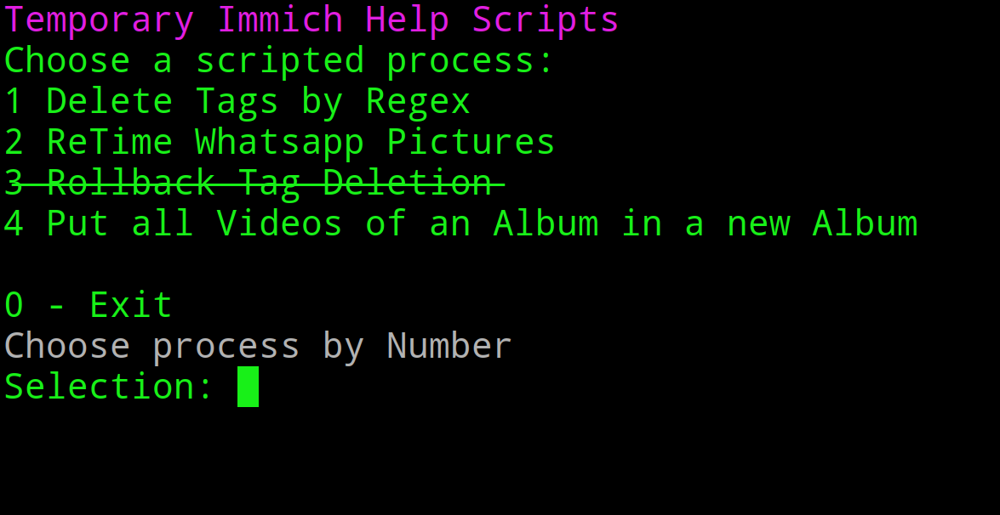

# Temporary Immich Help

With every day Immich gets more powerful and gains new utility, for now not everything is easily possible with the supplied tools. At one point my work here might be pointless, but for now this repository contains some quick scripts that help me facilitate more complex functions at the drop of a hat

## Features

### Deleting tags by Regex

Needs API Key with Permissions: `asset.read`, `tag.read`, `tag.delete`

_Background_ I use some ancient, cobbled together python gui to assign gps coordinates to camera pictures using an gpx file. This works fine, I played a bit with the settings during a period and one of those settings adds tags for the position, those are mighty useless, eg. _0.01 km north of Berlin_ and clutter the interface. I wanted them gone.

### ReDate Whatsapp Images 

Needs API Key with Permissions: `album.read`, `asset.update`

For reasons only known to past me I transport my whole WhatsApp Picture folder and everything from one Smartphone to another. At some point, in my case, April 2022 all pictures from before that lost their file date and now the files are cluttered and one specific day. This is annoying. The good news is, the files itself got the correct date in their name so its a solveable problem and I can enrich them with meta data.

### Putting all Videos of an Album in a new Album

The scenario here is that i foolishly activated auto update on my 128 gig `Camera` Folder on my phone. There are only around 20 gig of Pictures from the last 15 Years (I actually importet older digi cam pictures), so just the normal stuff I like to have locally available when speaking with people for visual refrence. There are also Videos. Videos I have backed up elsewhere, Videos that I look at upon occassion but that have no place in my Immich instance. Luckily, the automatic app upload puts everything into seperate albums. Its actually quite intelligent about it, it doesnt uploads duplicated but puts those into the album aswell. But, one cannot filter for albums, or filter an album for videos only. So here I am, writing another stupid script.

---
## Not yet implemented

### Rolling Back the deleted tags by the Regex Tag Deleter

Turns out, when deleting something, its actually quite easy to save that state and build an utility to roll all those changes back.

## Coding

I was really considering to build this as an Textual Interface but I am short in time and I just need the utility, no fancy. I firmly believe in Open Source so at least some attempt for resuability is made, but that's about it. We all will get eaten by vulture capitalists anyway.

if for some reasons I find time or just the feeling of creating something from the cold Abyss, I might reevaluate. Or if I find more niché functions that needs to be implemented.

All this really does is doing API calls anyway. So expect no wonders.

*Addendum* Turns out I actually wrote a project in 2022 with `cmd.Cmd` and I forgot all about it. That would have helped to speed up the interface of this one without resorting to a full powered TUI with textual. Oh well.